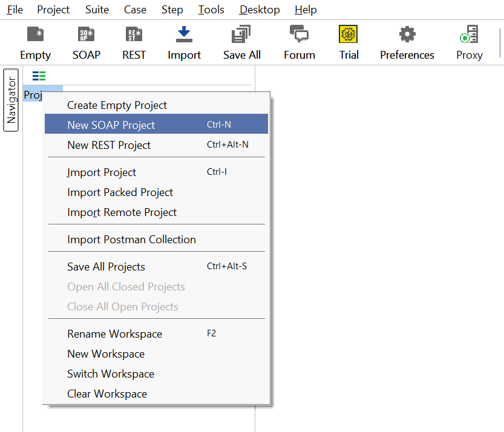
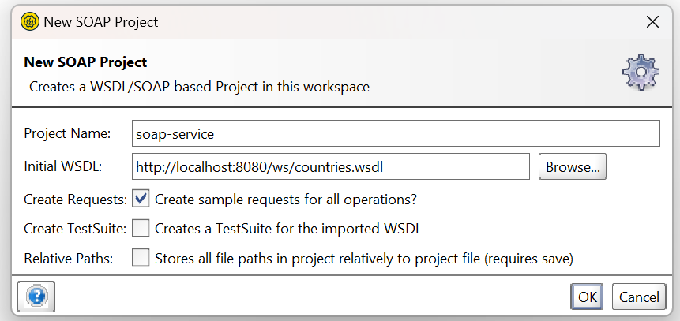
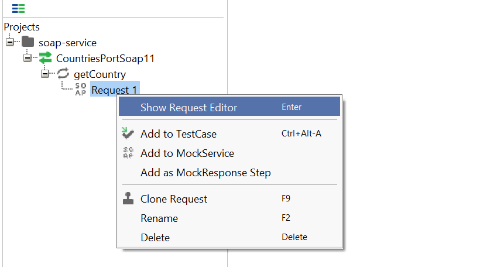
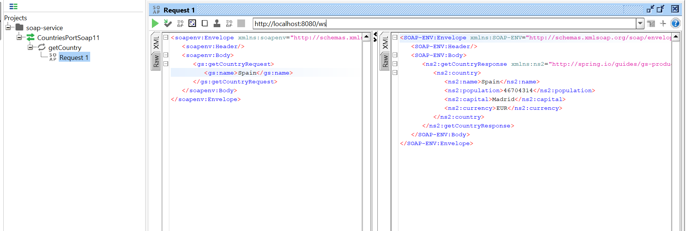

## Building a WSDL-based SOAP Web Service with Spring

### Requirements

Java 17 or later  
Maven 3.5+

### Quick Setup

```java
git clone [your-repo-url]
cd [local path]
```

Run the application by using `./mvnw spring-boot:run` Alternatively, you can build the JAR file with `./mvnw clean package` and then run the JAR file, as follows:
`java -jar target/gs-soap-service-0.1.0.jar`

#### WSDL and Service URL

`http://localhost:<port>/ws/countries.wsdl` `http://localhost:<port>/ws`

### Test the application

You can use something similar to SoapUI as follow:  
<br/>  




